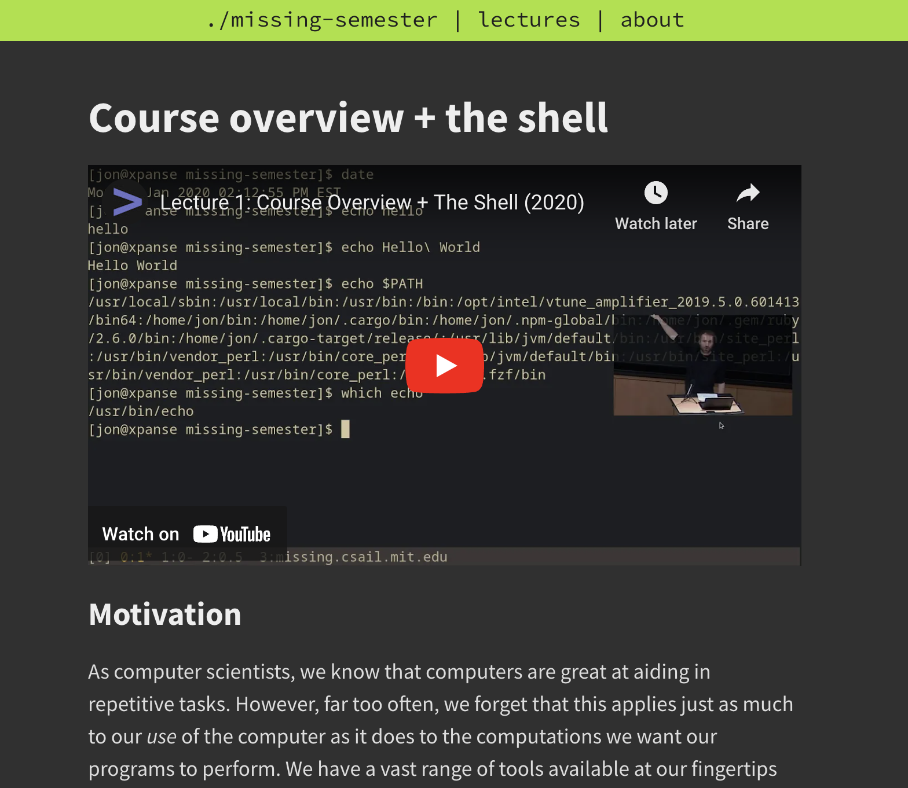

% From novice to expert
% navigating your journey in tech
% Khalid Lafi

---


### $ whoami

- Khalid Lafi Almouraikhy
- Principal Engineer @Mozn - Co-Founder @ByLinker
- ~15 years of experience.
- I build a lot of open source projects [Github: @lafikl](https://github.com/lafikl)
- I gave talks on them at O'rielly Velocity 2014 and RedisConf 2018 in San francisco

---

This talk is based on my personal experience, as a reflection to what worked for me. While trying to generalize the lessons learned.

---

## Outline
- You're about to graduate/freshgrads
- New Hire
- You want to become senior
- Stories

---

## Types of knowledge

---


- Fundamental knowledge. (long lasting age, and transferrable)
    - Data structures & Algorithms
    - Computer Architecture
    - Operating Systems
    - Network

---

- Specific knowledge that isn't fundamental (like mastering a framework).
    - React
    - Django
    - Flutter
    ...etc


---


---

<div style="max-width: 70%; display: inline-block">

</div>


---

# T
### Aim to be a T-shaped person
You just started, don't focus on one discipline.. explore everything, know what's out there.
With time you should dive deeper at the areas that interests you.

---

According to Paul Graham:


> The first step is to decide what to work on. The work you choose needs to have three qualities:  
> it has to be **something you have a natural aptitude for**, that you have a **deep interest in**, and that offers scope to do great work.

[How to do great work](https://paulgraham.com/greatwork.html)


---

You're about to graduate or you're a freshgrad

What do you need to **do**?

---

**Build something, take it through the full cycle. And keep it running!**  
Don't pay attention to best practices.  
Just build something and deploy it.
You gain have a mental model of how things work on a very high-level.

Examples:  

- Restful API
- Website with small function (url shortner)


---

**Now we dig deeper.**

What do you need to **learn**?

---

### Terminal & Shell

<div style="float: left; max-width: 50%; display: inline-block">

</div>

<div style="float: right; max-width: 50%;">
- [Course overview + the shell](https://missing.csail.mit.edu/2020/course-shell/)
- [Shell Tools and Scripting](https://missing.csail.mit.edu/2020/shell-tools/)
- [Data Wrangling](https://missing.csail.mit.edu/2020/data-wrangling/)
</div>


---


### Linux/Unix

You should be able to answer these questions:  

- What's a process?
- How to know what process is running?
- How to have a process always running? (Daemon)
- What's a file descriptor?

**My first outage was caused by full disks. Because, i didn't know i had to rotate logs**

---

### How process works in linux/unix

---

[Bottom Up CS](https://www.bottomupcs.com/)  

- Chapter 5. The Process
- Chapter 8. Behind the process

[Notes](https://gist.github.com/lafikl/66db0391f8398fd85b17f908930cd2b5)

---

<div style="float: right; max-width: 50%;">
[UNIX and Linux System Administration Handbook 5th Edition](https://www.amazon.com/UNIX-Linux-System-Administration-Handbook/dp/0134277554)  
- Section 4.2
</div>


<div style="float: left; max-width: 50%; display: inline-block">

</div>


---

### Linux/Unix


<div style="float: right; max-width: 50%;">
[Advanced Programming in the UNIX Environment, 3rd Edition](https://www.amazon.com/Advanced-Programming-UNIX-Environment-3rd/dp/0321637739)  
- Read the first section only.
</div>


<div style="float: left; max-width: 50%; display: inline-block">

</div>


---


Learn algorithms and data structures  

- You can get from a very bad solution to a 10x better one just by picking the right data structure.

[List](https://gist.github.com/lafikl/5d70722a7e453370434bfbbd06baaf78#file-algosdist-md)


---

# Real Story 

---


You have a CSV file containing
```csv
start_ip, end_ip,vpn,hosting
192.0.0.1,192.0.0.2,true,false
...
...
...
```
The file size is 10GB on disk, but in memory it becomes 200GB. How can you read it into memory to serve a function like this
```
func is_vpn(ip string) bool
```

Which data structure & algorithm you would use?

---

Git  

-  [MIT missing semester: Git](https://missing.csail.mit.edu/2020/version-control/)
-  [dangit](https://dangitgit.com/)

Git uses merkle-trees. I explained them here  

[Merkle Tree](https://newsletterbylinker.substack.com/p/merkle-tree-git-and-tls-and-dynamo)


---

Learn how the network works, on a high-level

- [Life of an HTTP request](https://github.com/hardikvasa/http-connection-lifecycle?tab=readme-ov-file#the-connection)

---

Learn SQL and how to use databases. Pick an RDBMS and learn it, preferably Postgres.

---

Pick a language and build things in it, practice as much as you can.

---

Learn how to use Docker

---

Keep in mind there's no magic anywhere.. it's all abstractions made by humans and you can dive deep every now and then to see how it works.

---

# New hire  

Congrats you got hired!

---

### Things you'll see

Software delivery cycle:  

- How they collaborate, manage code? (Git, Github, Gitlab)
- How do they ship the software? (CI/CD)
- How they package the software? (Docker)
- How they test? (Unit tests, integration tests, e2e tests)


---


Spend time learning the company core business:  
- **What matters to them? how they make money?**  

This will be handy when you want to make technical decisions, because you can align what you do with it.


---


## How to be structured in making a decision?

---

#### Every engineering decision has a trade-off, so you should be able to answer these questions:  

- What are you trying to solve?
- What solutions did you consider? each one with its own trade-offs
- Which solution are you choosing and why?


---

Read a lot of open source code, from different projects you're using.  
It's the best way to become a better engineer.

Examples:  

- NGINX
- Redis
- Kubernetes


---


<div style="float: left; max-width: 50%; margin-top: 50px;">
Read how other engineers, work. I highly recommened Coders At Work.
</div>


<div style="float: right; max-width: 50%; display: inline-block">

</div>


---


---


Read my post on 

[وش تحتاج تعرف كمبرمج؟](https://newsletterbylinker.substack.com/p/399)


---

Learn distributed systems  

Books  

- [Distributed systems for fun and profit](https://book.mixu.net/distsys/single-page.html)
- [Designing Data-Intensive Applications](https://www.amazon.sa/-/en/Designing-Data-Intensive-Applications-Reliable-Maintainable/dp/1449373321)

Video Course  

- [MIT 6.5840](https://pdos.csail.mit.edu/6.824/schedule.html)


---

<div style="float: right; max-width: 50%;">
[An Empirical Study of Load Balancing Algorithms
](https://lafikl.github.io/liblb-site/study.html)  
</div>


<div style="float: left; max-width: 50%; display: inline-block">


</div>


Learn how load balancing work


---


Thanks you!

For more questions reach out to me on:

- Twitter: [@iklafi](https://x.com/iklafi)
- Github: [@lafikl](https://github.com/lafikl)
